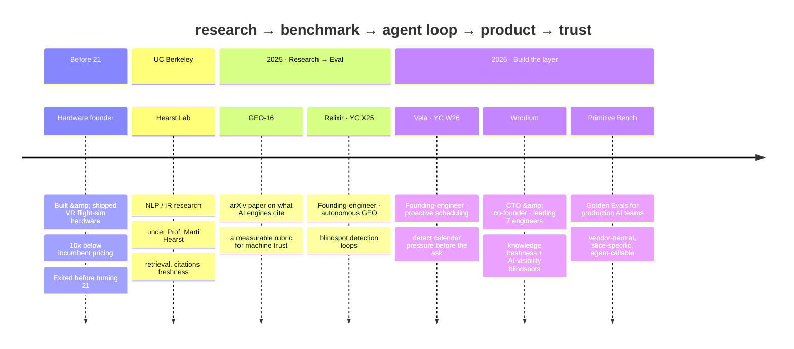
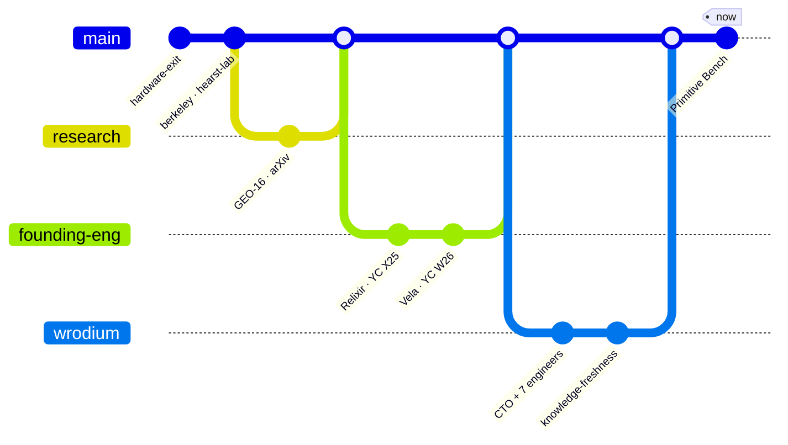
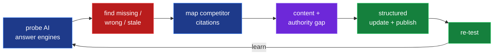
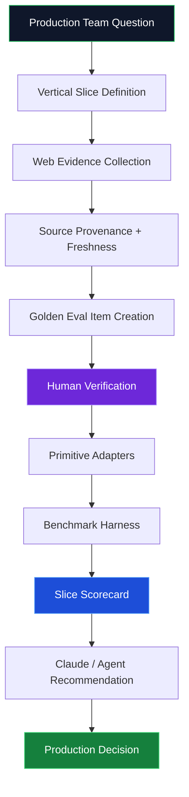

<!-- ============================================================= -->
<!--  ARLEN FREDERICK KUMAR · PROFILE README                       -->
<!--  Aesthetic: terminal / build-log · slate #0F172A + run-green  -->
<!-- ============================================================= -->

<!-- ===================== HEADER BANNER ===================== -->
<a href="https://arlenkumar.com">
  
</a>

<!-- ===================== TYPING SUBTITLE ===================== -->
<div align="center">

[](https://arlenkumar.com)

</div>

<!-- ===================== BADGE ROW ===================== -->
<div align="center">

[](https://arlenkumar.com)
[](https://wrodium.com)
[](https://www.primitivebench.com)
[](https://arxiv.org/abs/2509.10762)
<br/>
[](https://tryvela.ai)
[](https://www.relixir.ai/rex)
[](https://github.com/primitive-bench/benchpublic)
[](https://www.linkedin.com/in/arlen-frederick-kumar-1198592b8)


</div>

---

<!-- ===================== WHOAMI TERMINAL ===================== -->
```bash
arlen@berkeley:~$ whoami --verbose

  ▸ role        CTO & co-founder @ Wrodium  ·  leading 7 engineers
  ▸ research    NLP/IR @ UC Berkeley · Hearst Lab (Prof. Marti Hearst)
  ▸ founder     2x — shipped hardware 10x below incumbent, exited before 21
  ▸ building    Golden Evals · knowledge freshness · agent-native trust surfaces
  ▸ thesis      AI should choose, cite, retrieve & act from BETTER evidence
  ▸ honors      Berkeley SkyDeck B21 · "Most Innovative Technology"

arlen@berkeley:~$ _
```

---

<!-- ===================== TIMELINE (THE ARC) ===================== -->
## 🧭 The Arc — how I got here

> A throughline, not a résumé: **measure the invisible layer → make it callable by agents → ship the trust surface.**



<details>
<summary><b>🌿 Prefer it as a git history? (click)</b></summary>



</details>

---

<!-- ===================== WRODIUM — LEADERSHIP HERO ===================== -->
## 🛰️ Now — Leading Wrodium

<table>
<tr>
<td width="56%" valign="top">

I **lead a team of 7 engineers** building **knowledge-freshness infrastructure** that automates how enterprises find the **blindspots in their AI visibility** — and turns those gaps into **recovered revenue** before it leaks out of the building.

The old web optimized for blue links. The new web is mediated by **answer engines.** If an AI engine summarizes your category and you're **stale, missing, misrepresented, or uncitable**, you don't just lose traffic — **you lose the decision before the user ever reaches your site.**

```diff
  What we automate for the enterprise
+ Blindspot detection   where AI engines get you wrong, stale, or absent
+ Visibility telemetry  citations, share-of-voice, competitor presence
+ Knowledge freshness   content drift, stale claims, decaying authority
+ Machine readability   schema, semantic structure, citation-ready pages
+ Revenue recovery      every missed mention → a measurable action loop
```

> **A blindspot is not an analytics gap. It's a missing action loop — and a line of revenue leaking out of the building.**

</td>
<td width="44%" valign="top">


<div align="center"><sub><b>The Wrodium team @ Berkeley SkyDeck</b><br/>7 engineers shipping knowledge-freshness infrastructure</sub></div>

</td>
</tr>
</table>



**📍 [wrodium.com](https://wrodium.com) · [SCET: solving knowledge decay](https://scet.berkeley.edu/meet-leanid-palkhouski-the-entrepreneur-solving-knowledge-decay/)**

---

<!-- ===================== PRIMITIVE BENCH ===================== -->
## 🎯 Primitive Bench — the Claude Skill for Golden Evals

> Give Claude or a production team a **vertical, a workflow, and a data need.** Primitive Bench turns the open web into a **verified golden set**, runs vendors against it, and says **what actually works in production.**



Each question becomes a **slice** — `primitive + vertical + task + data shape + metric + failure mode`. That's *why one winner is a lie:*

| Vertical | Production workflow | Golden eval slice |
|---|---|---|
| 🏥 Healthcare | Current clinical-trial / provider info | Freshness-sensitive medical retrieval |
| ⚖️ Legal | Case law, clauses, citations | Citation-exact legal retrieval |
| 💵 Finance | Filings, earnings, market-moving claims | Time-sensitive source grounding |
| 🛡️ Insurance | PDFs, forms, claim evidence | OCR + extraction on form-heavy docs |
| 📈 Sales / GTM | Technographics + buyer intent | Web company-data accuracy |
| 🛒 E-commerce | Product specs, prices, availability | Table + schema fidelity |

```bash
bench run --primitive web-search --slice fintech.freshness-sensitive
bench run --primitive extraction  --slice ecommerce.table-fidelity
bench decision-card --vertical fintech --workflow sales-intelligence
```

**Principles:** no pay-to-rank · public methodology · private holdouts · hand-verified gold · *cost per correct answer beats cost per call.*
**📍 [primitivebench.com](https://www.primitivebench.com) · [github.com/primitive-bench/benchpublic](https://github.com/primitive-bench/benchpublic)**

---

<!-- ===================== OTHER WORK GRID ===================== -->
## 🚀 The rest of the constellation

<table>
<tr>
<td width="50%" valign="top">

### 📑 GEO-16 — *what AI engines cite*
SEO asks *"how do I rank?"* GEO asks *"how do I become the source an AI trusts enough to cite?"* A measurable rubric for machine-readable trust: metadata, semantic HTML, structured data, provenance, source trails.
**📍 [arXiv:2509.10762](https://arxiv.org/abs/2509.10762)**

</td>
<td width="50%" valign="top">

### 🗓️ Vela — *proactive scheduling* `YC W26`
Founding-engineer work moving scheduling from **reactive inbox → proactive intelligence**: detect overbooked days, route findings to the agent pipeline, refuse to act when live state is missing instead of hallucinating.
**📍 [tryvela.ai](https://tryvela.ai)**

</td>
</tr>
<tr>
<td width="50%" valign="top">

### 🧭 Relixir — *autonomous GEO* `YC X25`
Founding-engineer exposure to blindspot automation: probe engines → find missing mentions → map competitor citations → close gaps → publish → re-test. The product isn't a dashboard; it's the **closed loop between measurement and action.**
**📍 [relixir.ai/rex](https://www.relixir.ai/rex)**

</td>
<td width="50%" valign="top">

### 🐟 Side experiments
**`llms.txt Generator`** — AI-readable site maps · **`Benchmark Graveyard`** — a museum of dead benchmarks · **`Proof Duel Arena`** — sportscast theorem proving · **`regress.fish`** — NOAA forecast with a public Brier scoreboard.
**📍 [arlenkumar.com/projects](https://arlenkumar.com/projects)**

</td>
</tr>
</table>

---

<!-- ===================== TECH STACK ===================== -->
## 🛠️ Stack & focus

<div align="center">


<br/>


</div>

| Domain | What I work on |
|---|---|
| **🏅 Golden evals** | Vertical eval design · human-verified gold · source trails · holdout integrity · cost-per-correct · silent-failure detection |
| **🔎 Retrieval & RAG** | Hybrid dense+sparse · BM25 + vector · RRF fusion · cross-encoder reranking · citation enforcement · freshness scoring |
| **📊 AI evaluation** | Split integrity · confidence intervals · statistical separability · contamination detection · vendor-neutral methodology |
| **🤖 Agent infra** | Claude Skills · MCP servers · tool selection · `llms.txt` · JSON-LD · guardrailed autonomy · refusal paths |
| **🧭 Autonomous GEO** | Share-of-voice · mention/citation tracking · content-gap detection · semantic chunking · CMS refresh loops |

---

<!-- ===================== GITHUB STATS ===================== -->
## 📈 GitHub signals

<div align="center">


</div>

---

<!-- ===================== PRINCIPLES ===================== -->
## 🧠 How I think

> **1.** Research is only useful if it changes what gets built. *Paper → rubric → dashboard → workflow → outcome.*
>
> **2.** Benchmarks should be honest enough to disappoint you. *One that always confirms the obvious is marketing.*
>
> **3.** The next reader is a machine. *AI increasingly decides what gets read, cited, fetched, bought, scheduled.*
>
> **4.** "Best" is the wrong question. *Best for which slice, under which constraint, at what cost, with what failure mode?*
>
> **5.** Autonomy without guardrails is just vibes with permissions. *Agents need thresholds, vetoes, state checks, refusal.*
>
> **6.** A dashboard is not enough. The best systems close the loop → `measure → diagnose → act → re-test → learn`

---

<!-- ===================== FOOTER ===================== -->
<div align="center">

### Build the eval. Verify the source. Score the slice. Make it agent-callable.

[](https://arlenkumar.com)
[](mailto:arlen1788@berkeley.edu)
[](https://www.linkedin.com/in/arlen-frederick-kumar-1198592b8)


</div>
