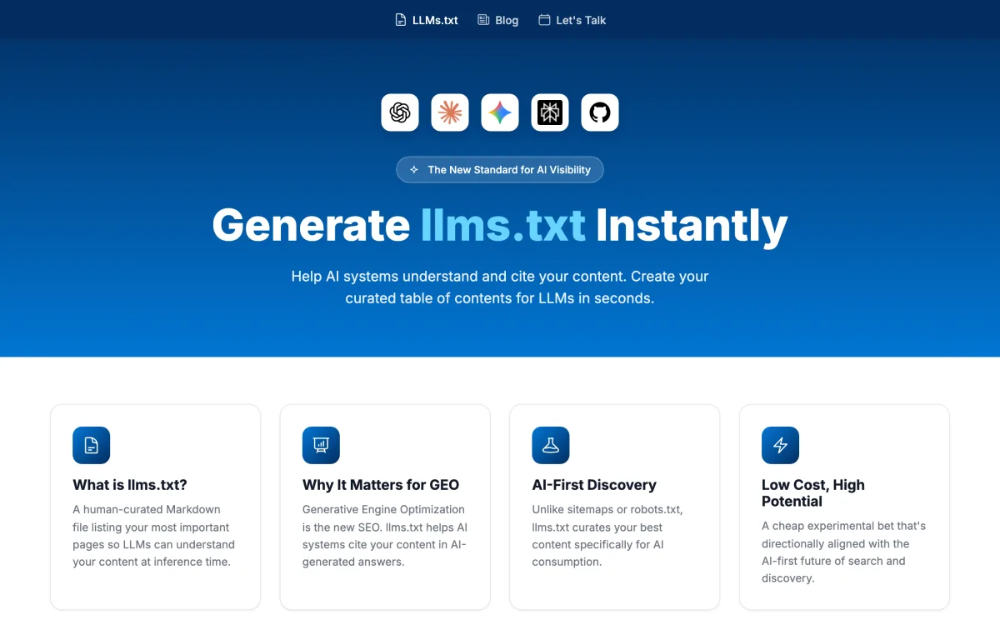

<h1 align="center">Hi, I'm Arlen Kumar 👋</h1>

<b>I build systems that fight bureaucracy and measure AI.</b>

CTO at <a href="https://wrodium.com">Wrodium</a> · NLP/IR researcher at UC Berkeley's Hearst Lab (under Prof. Marti Hearst) · two-time founder (prior exit: Air Quake Simulations).

  
  
  
  

---

### 🔬 GEO-16 — what makes AI search engines *cite* a page

First-author paper, **[arXiv:2509.10762](https://arxiv.org/abs/2509.10762)** ([plain-language explainer](https://arlenkumar.com/geo-16)).

> **One-line finding:** the pages AI engines cite aren't the best-*written* — they're the most *machine-readable*. Metadata & freshness, semantic HTML, and structured data predict citation more than prose quality.

### 🏢 Wrodium

The knowledge-freshness + GEO/AEO infrastructure layer between brands and AI. It measures a brand's share of voice, citations, and sentiment across ChatGPT / Gemini / Perplexity — then helps generate on-brand content that wins those citations. Berkeley SkyDeck–backed.

### 🛠️ Currently building

- **noticeright** — an eviction-compliance engine making tenant-defense paperwork procedurally bulletproof *(Berkeley · v1)*
- **CHASE @ COLM 2026** — research paper under review at the Conference on Language Modeling *(decisions Jul 8, 2026)*
- **Wrodium** — GEO infrastructure for the AI-search era *(closed a $1.5M pre-seed)*

### ⚡ llms.txt Generator — a free GEO tool

Generate an `llms.txt` for any site: a curated table of contents that helps LLMs understand and cite your content.

▶️ **Live tool: [arlenkumar.com/llms-generator](https://arlenkumar.com/llms-generator.html)**
(GitHub strips `&lt;iframe&gt;` from READMEs, so this preview links straight to the live tool.)

---

🌐 <a href="https://arlenkumar.com">arlenkumar.com</a> &nbsp;·&nbsp;
💼 <a href="https://www.linkedin.com/in/arlen-frederick-kumar-1198592b8/">LinkedIn</a> &nbsp;·&nbsp;
🎓 <a href="https://scholar.google.com/scholar?q=GEO-16+Generative+Engine+Optimization+Kumar">Scholar</a> &nbsp;·&nbsp;
📄 <a href="https://arxiv.org/abs/2509.10762">GEO-16 (arXiv)</a>

