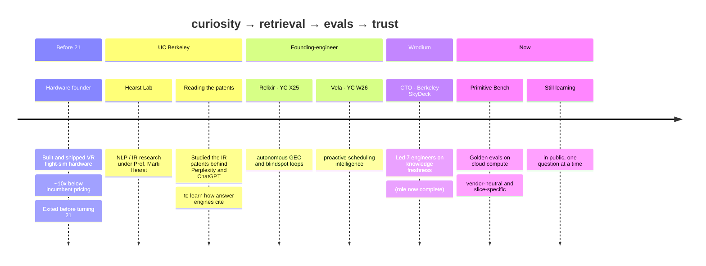
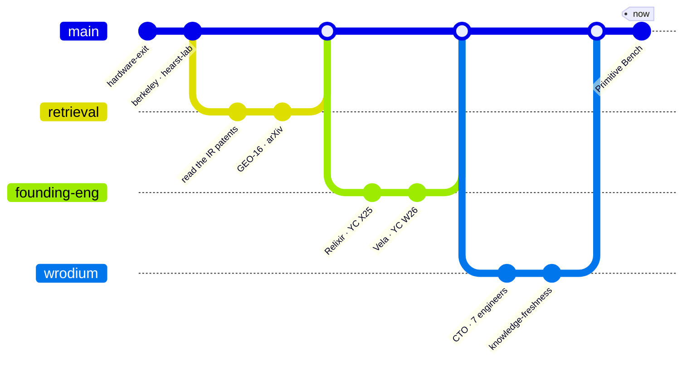
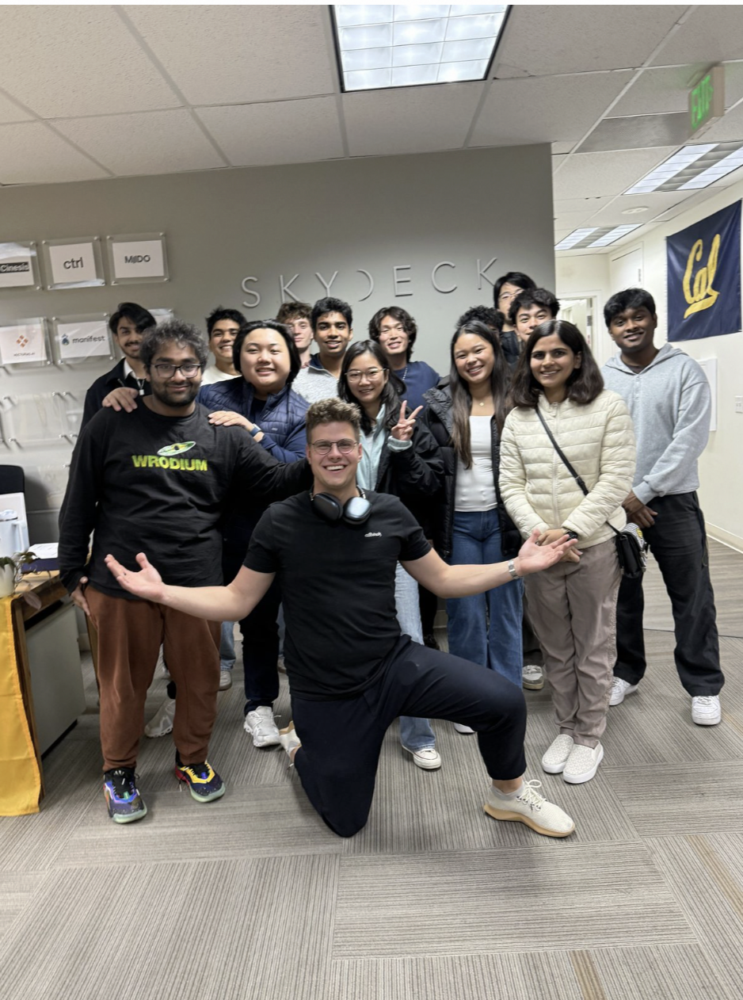
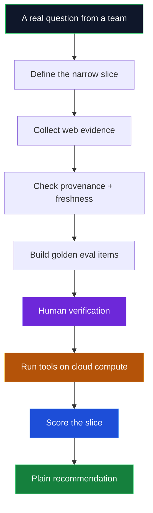

<!-- ============================================================= -->
<!--  ARLEN FREDERICK KUMAR · PROFILE README                       -->
<!--  Aesthetic: terminal / build-log · slate #0F172A + run-green  -->
<!-- ============================================================= -->

<!-- ===================== HEADER BANNER ===================== -->
<a href="https://arlenkumar.com">
  
</a>

<!-- ===================== TYPING SUBTITLE ===================== -->
<div align="center">

[](https://arlenkumar.com)

</div>

<!-- ===================== BADGE ROW ===================== -->
<div align="center">

[](https://arlenkumar.com)
[](https://skydeck.berkeley.edu)
[](https://www.primitivebench.com)
[](https://arxiv.org/abs/2509.10762)
<br/>
[](https://wrodium.com)
[](https://tryvela.ai)
[](https://www.relixir.ai/rex)
[](https://www.linkedin.com/in/arlen-frederick-kumar-1198592b8)


</div>

---

<!-- ===================== WHOAMI TERMINAL ===================== -->
```bash
arlen@berkeley:~$ whoami

  Hi, I'm Arlen. I build small tools that help AI systems retrieve,
  cite, and act from better information. Most of them start the same
  way: I get curious about how something works and can't stop until
  I've rebuilt it myself and measured whether it's any good.

  former CTO   Wrodium — knowledge freshness for AI search (role now wrapped)
  founder      Berkeley SkyDeck · 2x founder — shipped hardware, exited before 21
  obsessed     information retrieval — I read the patents behind Perplexity
               & ChatGPT to learn how answer engines actually decide what to cite
  building     golden evals + benchmarks that run on cloud compute
  learning     in public, still early, still figuring it out

arlen@berkeley:~$ _
```

---

<!-- ===================== THE ARC ===================== -->
## The arc — how I got here

> Less a résumé, more a habit: **get curious → read the source → rebuild it → measure if it's real.**



<details>
<summary><b>Prefer it as a git history? (click)</b></summary>



</details>

---

<!-- ===================== INFORMATION RETRIEVAL ===================== -->
## How answer engines decide — so I read the patents

I kept seeing people optimize for ChatGPT and Perplexity by guessing. I wanted to understand the mechanism instead of the folklore, so I went to the primary source: the **information-retrieval patents** behind these products — how Perplexity ranks and cites, how OpenAI's retrieval patterns work, how classic IR weighs authority against freshness.

Reading them changed how I build. A few patterns I keep coming back to:

```txt
• how a system decides a source is "authoritative enough" to cite
• how recency and freshness get weighed against authority
• how query understanding reshapes what counts as a relevant chunk
• where retrieval quietly fails — and nobody notices the silent miss
```

Then I try to rebuild and measure those patterns. That curiosity is where **GEO-16** (a rubric for what makes a page citation-worthy) and **Primitive Bench** (benchmarks for the retrieval tools agents actually use) both came from.

**📍 [GEO-16 · arXiv:2509.10762](https://arxiv.org/abs/2509.10762)**

---

<!-- ===================== WRODIUM ===================== -->
## Wrodium — what I led as CTO

<table>
<tr>
<td width="56%" valign="top">

As **CTO, I led a team of 7 engineers** at Wrodium (Berkeley SkyDeck) building **knowledge-freshness infrastructure** — tools that show a company where AI answer engines describe it **wrong, stale, or not at all**, and help it fix the gaps before they cost real business. I've since wrapped up that role, but it's where a lot of my thinking about retrieval and freshness took shape.

The simple idea behind it:

```txt
The old web competed for blue links. The new web is read by answer
engines first. If you're invisible or out of date inside them, you
can lose the decision long before anyone visits your site.
```

What the team built:

```diff
+ Blindspot detection   where AI engines get a company wrong, stale, or absent
+ Visibility telemetry  citations, share-of-voice, competitor presence
+ Knowledge freshness   catching content drift and decaying authority
+ Machine readability   schema and structure that make pages easy to cite
```

</td>
<td width="44%" valign="top">



<div align="center"><sub><b>Led the Wrodium team @ Berkeley SkyDeck</b><br/>7 engineers · knowledge-freshness infrastructure</sub></div>

</td>
</tr>
</table>

**📍 [wrodium.com](https://wrodium.com) · [SCET feature](https://scet.berkeley.edu/meet-leanid-palkhouski-the-entrepreneur-solving-knowledge-decay/)**

---

<!-- ===================== PRIMITIVE BENCH ===================== -->
## Primitive Bench — what I'm working on now

A small, vendor-neutral way to answer a practical question: *for this specific job, which retrieval or extraction tool actually works?* You give it a vertical, a workflow, and a data need; it builds a hand-verified golden set from the open web, runs each tool through the same harness **on cloud compute**, and reports what holds up.



The thing I keep relearning: **there's no single winner.** A tool that's great for legal citations can be wrong for e-commerce tables. So I score narrow slices, not categories — and I count **cost per *correct* answer**, since a cheap API that's wrong is the expensive one once you add up the cloud-compute bill behind it.

```bash
bench run --primitive web-search --slice fintech.freshness-sensitive
bench run --primitive extraction  --slice ecommerce.table-fidelity
bench decision-card --vertical fintech --workflow sales-intelligence
```

**📍 [primitivebench.com](https://www.primitivebench.com) · [github.com/primitive-bench/benchpublic](https://github.com/primitive-bench/benchpublic)**

---

<!-- ===================== OTHER WORK ===================== -->
## A few other things I've built

<table>
<tr>
<td width="50%" valign="top">

### Vela — proactive scheduling `YC W26`
Founding-engineer work on moving scheduling from **reactive inbox → proactive intelligence**: notice an overbooked day, route it to the agent pipeline, and *refuse to act* when live calendar state is missing instead of guessing.
**📍 [tryvela.ai](https://tryvela.ai)**

</td>
<td width="50%" valign="top">

### Relixir — autonomous GEO `YC X25`
Founding-engineer exposure to blindspot automation: probe answer engines → find missing mentions → map competitor citations → close the gap → re-test. Taught me a product isn't a dashboard; it's the loop between measuring and acting.
**📍 [relixir.ai/rex](https://www.relixir.ai/rex)**

</td>
</tr>
<tr>
<td width="50%" valign="top">

### llms.txt Generator
A free tool that crawls a site and writes its `llms.txt` — a clean map of what an AI engine should understand and cite. The lowest-effort, highest-leverage thing most sites are missing.
**📍 [arlenkumar.com/projects](https://arlenkumar.com/projects)**

</td>
<td width="50%" valign="top">

### Smaller experiments
**`Benchmark Graveyard`** — a museum of dead AI benchmarks and why they collapsed · **`regress.fish`** — a NOAA fishing forecast that publishes its own error with a Brier scoreboard, because a model that admits when it's wrong is easier to trust.

</td>
</tr>
</table>

---

<!-- ===================== STACK & FOCUS ===================== -->
## What I work with

<div align="center">


<br/>


</div>

| Area | What it means in practice |
|---|---|
| **Information retrieval** | Reading the patents · hybrid dense+sparse · BM25 + vector · reranking · citation behavior · freshness vs. authority |
| **Evaluation** | Hand-verified golden sets · per-slice scoring · cost per *correct* answer · catching silent failures |
| **Cloud compute** | Running eval harnesses at scale · distributed benchmark runs · treating cost-per-correct as a real compute budget |
| **Agent tooling** | Claude Skills · MCP servers · `llms.txt` · JSON-LD · guardrails and refusal paths when state is missing |

---

<!-- ===================== GITHUB STATS ===================== -->
## A bit of GitHub

<div align="center">


</div>

---

<!-- ===================== HOW I THINK ===================== -->
## A few things I believe

> **1.** Research is only useful if it changes what gets built. *A paper should become a rubric, then a tool, then an outcome.*
>
> **2.** A benchmark should be honest enough to disappoint you. *If it always confirms the obvious, it's marketing.*
>
> **3.** "Best" is usually the wrong question. *Better: best for which slice, at what cost, with what failure mode?*
>
> **4.** Autonomy needs guardrails. *An agent should be willing to refuse when it isn't sure.*
>
> **5.** I'd rather be useful than impressive, and I'm still learning either way.

---

<!-- ===================== FOOTER ===================== -->
<div align="center">

### Get curious. Read the source. Rebuild it. Measure if it's real.

[](https://arlenkumar.com)
[](mailto:arlen1788@berkeley.edu)
[](https://www.linkedin.com/in/arlen-frederick-kumar-1198592b8)


</div>
