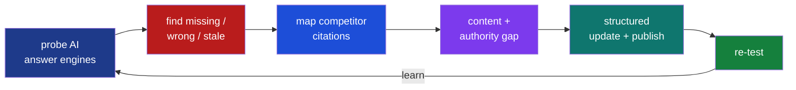
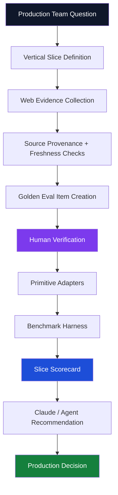

<!-- ====================== HEADER BANNER ====================== -->
<a href="https://arlenkumar.com">
  
</a>

<!-- ====================== TYPING SUBTITLE ====================== -->
<div align="center">

[](https://arlenkumar.com)

</div>

<!-- ====================== SOCIAL / PROJECT BADGES ====================== -->
<div align="center">

[](https://arlenkumar.com)
[](https://www.primitivebench.com)
[](https://wrodium.com)
[](https://arxiv.org/abs/2509.10762)
<br/>
[](https://tryvela.ai)
[](https://www.relixir.ai/rex)
[](https://github.com/primitive-bench/benchpublic)
[](https://www.linkedin.com/in/arlen-frederick-kumar-1198592b8)


</div>

---

<!-- ====================== INTRO ====================== -->
## 👋 Hi, I'm Arlen.

I'm a **builder, founder, and researcher** working on one question:

> **How do production AI teams know whether the data, primitive, model, retrieval stack, or workflow they're using is actually correct for their vertical?**

That question has become my operating system:


I'm building toward a world where Claude Code, Cursor, internal AI agents, and production teams **don't pick tools by vibes, vendor claims, or whatever provider is easiest to import.** They should be able to ask *"For this vertical, this use case, this data shape, and this cost/latency constraint — which primitive actually wins?"* — and get an answer backed by evidence.

---

<!-- ====================== TEAM / LEADERSHIP — WRODIUM ====================== -->
## 🛰️ Leading Wrodium — Knowledge Freshness for the Enterprise

<table>
<tr>
<td width="55%" valign="top">

I **lead a team of 7 engineers** building **knowledge-freshness infrastructure** that automates how enterprises find the **blindspots in their AI visibility** — and turns those gaps into **recovered revenue** before it's lost.

The old web optimized for blue links. The new web is mediated by **answer engines.** If an AI engine summarizes your category and your company is **stale, missing, misrepresented, or uncitable**, you don't just lose traffic — **you lose the decision before the user ever reaches your site.**

**What we automate for the enterprise:**

- 🔎 **Blindspot detection** — where AI engines describe you wrong, stale, or not at all
- 📡 **Visibility telemetry** — citations, share-of-voice, and competitor presence across AI answer surfaces
- ⏱️ **Knowledge freshness** — detecting content drift, stale claims, and decaying authority
- 🧩 **Machine readability** — schema, semantic structure, freshness markers, citation-ready pages
- 💰 **Revenue recovery** — converting every missed mention into a measurable action loop

> **A blindspot is not an analytics gap. It is a missing action loop — and a line of revenue leaking out of the building.**

</td>
<td width="45%" valign="top">


<div align="center"><sub><b>Leading the Wrodium team @ Berkeley SkyDeck</b> — 7 engineers shipping knowledge-freshness infrastructure</sub></div>

</td>
</tr>
</table>



**📍 [wrodium.com](https://wrodium.com) · [SCET feature: solving knowledge decay](https://scet.berkeley.edu/meet-leanid-palkhouski-the-entrepreneur-solving-knowledge-decay/)**

---

<!-- ====================== CURRENT THESIS ====================== -->
## 🧠 Current thesis

AI teams are shipping vertical products **faster than their evaluation systems can keep up.**

A healthcare AI system needs different evidence than a legal research agent. A finance workflow needs fresher source trails than a generic chatbot. A recruiting agent needs company and candidate truth that doesn't collapse under entity ambiguity.

The next layer isn't just *"better models."* It's:

> **Golden Evals for production teams — generated from real web data, audited by humans, scored by slice, and callable by agents.**

```txt
One winner is a lie.
The best primitive changes by vertical, data shape, freshness need, and failure mode.
```

---

<!-- ====================== PRIMITIVE BENCH ====================== -->
## 🎯 Primitive Bench — the Claude Skill for Golden Evals

> Give Claude or a production AI team a **vertical, a workflow, and a data need.** Primitive Bench turns the open web into a **verified golden set**, runs vendors and primitives against it, and tells the team **what actually works in production.**



**Each question becomes a slice** — a narrow production constraint: `primitive + vertical + task + data shape + metric + failure mode`. This is *why one winner is a lie:*

| Vertical | Production workflow | Golden eval slice |
|---|---|---|
| 🏥 Healthcare | Current clinical-trial / provider / policy info | Freshness-sensitive medical source retrieval |
| ⚖️ Legal | Case law, clauses, citations | Citation-exact legal retrieval |
| 💵 Finance | Filings, earnings, market-moving claims | Time-sensitive source grounding |
| 🛡️ Insurance | PDFs, forms, claim evidence | OCR + extraction on form-heavy docs |
| 🧑‍💼 Recruiting | Companies, roles, seniority, hiring signals | Entity-disambiguated company/person data |
| 📈 Sales / GTM | Technographics + buyer intent | Web company-data accuracy |
| 🛒 E-commerce | Product specs, prices, availability | Table + schema fidelity |
| 🔐 Cybersecurity | Vendors, CVEs, controls, risk claims | Source-traceable security intel |

<details>
<summary><b>📦 What a Golden Eval item looks like (click to expand)</b></summary>

```json
{
  "id": "fintech_technographics_001",
  "vertical": "fintech",
  "workflow": "sales intelligence",
  "task": "detect payment processor used by company",
  "gold": {
    "answer": "Stripe",
    "accepted_aliases": ["Stripe Payments", "Stripe Checkout"],
    "must_cite": ["https://example.com/pricing", "https://docs.example.com/payments"]
  },
  "source_trail": [
    { "url": "https://example.com/pricing", "evidence_type": "first_party_page",
      "retrieved_at": "2026-06-20", "freshness_requirement": "90d" }
  ],
  "metrics": ["hit@5", "field_accuracy", "citation_precision", "freshness_pass", "cost_per_correct"],
  "failure_modes": ["wrong_vendor", "stale_source", "uncited_claim", "entity_confusion"]
}
```

</details>

```bash
# representative shape
bench run --primitive web-search --slice fintech.freshness-sensitive
bench run --primitive extraction  --slice ecommerce.table-fidelity
bench decision-card --vertical fintech --workflow sales-intelligence
```

**Principles:** No pay-to-rank · public methodology · private holdouts · hand-verified gold · per-slice scoring · MCP-queryable · *cost per correct answer beats cost per call.*

**📍 [primitivebench.com](https://www.primitivebench.com) · [github.com/primitive-bench/benchpublic](https://github.com/primitive-bench/benchpublic)**

---

<!-- ====================== OTHER WORK ====================== -->
## 🚀 What else I'm building

<table>
<tr>
<td width="50%" valign="top">

### 📑 GEO-16 — *what AI answer engines cite*
Traditional SEO asks *"how do I rank?"* GEO asks *"how do I become the source an AI system trusts enough to cite?"* A measurable rubric for machine-readable trust: metadata, semantic HTML, structured data, authority, provenance, verifiable source trails.

**📍 [arXiv:2509.10762](https://arxiv.org/abs/2509.10762)**

</td>
<td width="50%" valign="top">

### 🗓️ Vela — *proactive scheduling intelligence*
Founding-engineer work on a YC W26 scheduling assistant. Moving scheduling from **reactive inbox handling → proactive intelligence**: detect overbooked days, route findings to the agent pipeline, and refuse to act when live state is missing instead of hallucinating.

**📍 [tryvela.ai](https://tryvela.ai) · [YC profile](https://www.ycombinator.com/companies/vela)**

</td>
</tr>
<tr>
<td width="50%" valign="top">

### 🧭 Relixir — *autonomous GEO blindspots*
Founding-engineer exposure to blindspot automation: probe answer engines → find missing mentions → map competitor citations → close content/authority gaps → publish → re-test. The product isn't a dashboard; it's the **closed loop between measurement and action.**

**📍 [relixir.ai/rex](https://www.relixir.ai/rex)**

</td>
<td width="50%" valign="top">

### 🐟 Side experiments
**`llms.txt Generator`** — curated AI-readable site maps · **`Benchmark Graveyard`** — a museum of dead AI benchmarks · **`Proof Duel Arena`** — sportscast-style theorem proving · **`regress.fish`** — NOAA fishing forecast with a public Brier-score scoreboard.

**📍 [arlenkumar.com/projects](https://arlenkumar.com/projects)**

</td>
</tr>
</table>

---

<!-- ====================== TECH STACK ====================== -->
## 🛠️ Tech & focus areas

<div align="center">


<br/>


</div>

| Domain | What I work on |
|---|---|
| **🏅 Golden evals** | Vertical eval design · human-verified gold · source trails · holdout integrity · cost-per-correct · silent-failure detection · decision cards |
| **🔎 Retrieval & RAG** | Hybrid dense+sparse · BM25 + vector · RRF fusion · cross-encoder reranking · query decomposition · citation enforcement · freshness scoring |
| **📊 AI evaluation** | Public/private split integrity · confidence intervals · statistical separability · contamination detection · vendor-neutral methodology |
| **🤖 Agent infra** | Claude Skills · MCP servers · tool selection for coding agents · `llms.txt` · JSON-LD · task queues · guardrailed autonomy · refusal paths |
| **🧭 Autonomous GEO** | Share-of-voice · mention/citation tracking · competitor monitoring · content-gap detection · semantic chunking · CMS refresh loops |

---

<!-- ====================== GITHUB STATS ====================== -->
## 📈 GitHub signals

<div align="center">


</div>

---

<!-- ====================== PRINCIPLES ====================== -->
## 🧭 How I think

> **1.** Research is only useful if it changes what gets built. *A paper → a rubric → a dashboard → a workflow → an outcome.*
>
> **2.** Benchmarks should be honest enough to disappoint you. *A benchmark that always confirms the obvious is marketing.*
>
> **3.** The next reader is a machine. *AI increasingly decides what gets read, cited, fetched, bought, and scheduled.*
>
> **4.** "Best" is the wrong question. *Best for which slice, under which constraint, at what cost, with what failure mode?*
>
> **5.** Autonomy without guardrails is just vibes with permissions. *Agents need thresholds, vetoes, state checks, and the willingness to refuse.*
>
> **6.** A dashboard is not enough. The best systems close the loop → `measure → diagnose → act → re-test → learn`

---

<!-- ====================== FOOTER ====================== -->
<div align="center">

### Build the eval. Verify the source. Score the slice. Make it agent-callable.

[](https://arlenkumar.com)
[](mailto:arlen1788@berkeley.edu)
[](https://www.linkedin.com/in/arlen-frederick-kumar-1198592b8)


</div>
