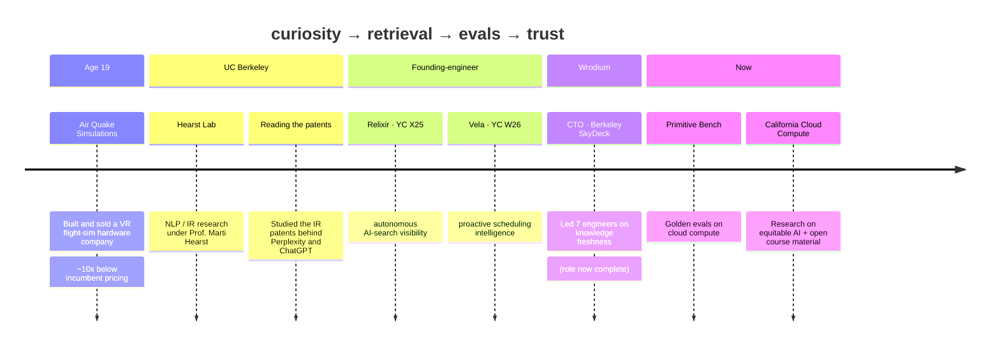
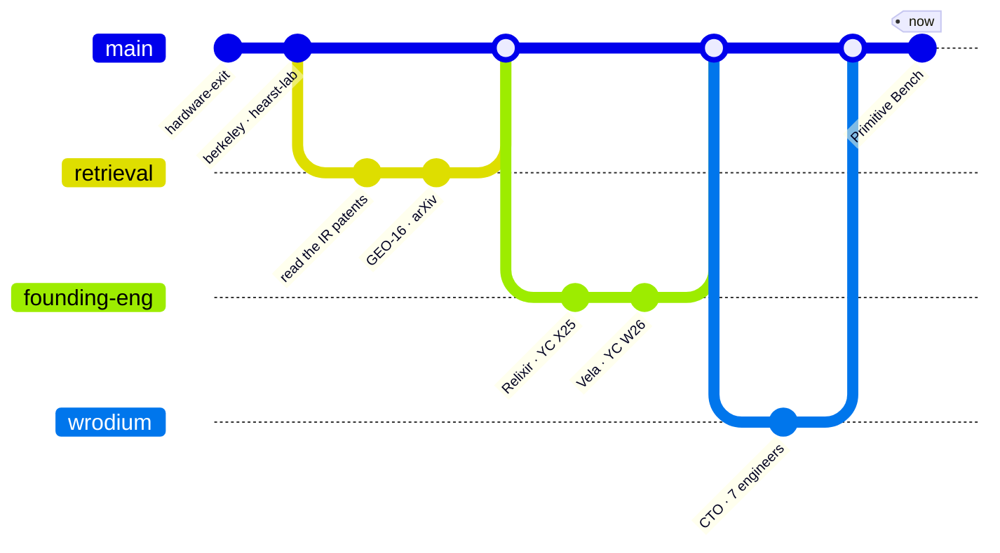

<!-- ============================================================= -->
<!--  ARLEN FREDERICK KUMAR · PROFILE README                       -->
<!--  Palette matches arlenkumar.com                               -->
<!--  amber #e8920a → orange #ea580c → rose #e0476b → purple #8b3fd6 -->
<!-- ============================================================= -->

<!-- ===================== HEADER BANNER ===================== -->
<a href="https://arlenkumar.com">
  
</a>

<!-- ===================== TYPING SUBTITLE ===================== -->
<div align="center">

[](https://arlenkumar.com)

</div>

<!-- ===================== BADGE ROW ===================== -->
<div align="center">

[](https://arlenkumar.com)
[](https://skydeck.berkeley.edu)
[](https://wrodium.com)
[](https://www.primitivebench.com)
<br/>
[](https://arxiv.org/abs/2509.10762)
[](https://tryvela.ai)
[](https://www.relixir.ai/rex)
[](https://www.linkedin.com/in/arlen-frederick-kumar-1198592b8)


</div>

---

## Hi, I'm Arlen 👋

I build systems that **fight bureaucracy and measure AI**.

Most of what I make starts the same way: I get curious about how something actually works, I can't let it go, and I don't feel like I understand it until I've rebuilt it myself and measured whether it's any good. That's the whole loop. Everything below is just me running it on a different problem.

Here's the short version of how I got here.

---

## It started with hardware

At **19**, I built and sold **Air Quake Simulations** — a VR flight-sim hardware company that shipped real product at roughly **10x below** what the incumbents charged. I exited before I turned 21.

That taught me the lesson I still use: an idea isn't real until it survives contact with the physical world, a budget, and someone willing to pay for it.

---

## Then I got obsessed with how AI *decides*

I went to **UC Berkeley** and did **NLP / information-retrieval research** in the **Hearst Lab** under Prof. Marti Hearst. Around then, everyone started "optimizing" for ChatGPT and Perplexity — mostly by guessing. That bothered me.

So instead of guessing, I read the source: the **information-retrieval patents** behind these products. How Perplexity ranks and cites. How modern retrieval weighs **freshness against authority**. Where retrieval quietly fails and nobody notices the miss.

That turned into **GEO-16** — a paper and a rubric for what actually makes a page worth citing to an AI answer engine.

> 📄 **[GEO-16 · arXiv:2509.10762](https://arxiv.org/abs/2509.10762)**

---

## I helped build a company around it

<table>
<tr>
<td width="56%" valign="top">

That research had an obvious use, so I helped build **Wrodium**, where I served as **CTO and led a team of 7 engineers** out of **Berkeley SkyDeck**.

The idea was simple: the old web competed for blue links, but the new web is read by **answer engines first**. If an AI describes your company **wrong, stale, or not at all**, you can lose the decision long before anyone visits your site. Wrodium found those blind spots and helped companies fix them.

I've since **wrapped up the CTO role** — but it's where most of my thinking about retrieval and freshness took shape, and where I learned how to lead engineers, not just code.

</td>
<td width="44%" valign="top">


<div align="center"><sub><b>The Wrodium team @ Berkeley SkyDeck</b><br/>7 engineers · knowledge-freshness infrastructure</sub></div>

</td>
</tr>
</table>

Along the way I also did founding-engineer work at two YC companies — **[Relixir](https://www.relixir.ai/rex)** `YC X25` (autonomous AI-search visibility) and **[Vela](https://tryvela.ai)** `YC W26` (proactive scheduling that refuses to act when it isn't sure) — both of which sharpened the same instinct: a product isn't a dashboard, it's the loop between **measuring** something and **acting** on it.

---

## Now: measuring the tools, and making compute fair

These days I'm split between two things I genuinely love.

**Primitive Bench** is the *measuring* half. It answers a very practical question — *for this specific job, which retrieval or extraction tool actually works?* You give it a vertical and a data need; it builds a hand-verified golden set from the open web, runs each tool through the same harness on cloud compute, and tells you what held up. The lesson I keep relearning: **there's no single winner.** A tool that's perfect for legal citations can be wrong for e-commerce tables — so I score narrow slices, and I count **cost per *correct* answer**, because a cheap API that's wrong is the expensive one once the compute bill arrives.

```bash
bench run --primitive web-search --slice fintech.freshness-sensitive
bench decision-card --vertical fintech --workflow sales-intelligence
```

**California Cloud Compute** is the *fairness* half. I'm doing research there on making serious compute **reachable for people who normally can't afford it** — students, public-interest researchers, smaller labs — and writing **open course material** so others can actually learn this, not just read about it. Most of my other work assumes you can spend freely on compute to measure things. This is the part that asks the opposite question: *how do we make that capability equitable in the first place?*

> 🎯 **[primitivebench.com](https://www.primitivebench.com)** · 📚 **California Cloud Compute — equitable AI + course material**

---

## The same story, as a timeline



<details>
<summary><b>Or the same thing as a git history (click)</b></summary>



</details>

---

## What I work with

<div align="center">


</div>

| Area | What it means in practice |
|---|---|
| **Information retrieval** | Reading the patents · hybrid dense + sparse · reranking · freshness vs. authority · catching silent failures |
| **Evaluation** | Hand-verified golden sets · per-slice scoring · cost per *correct* answer |
| **Cloud compute** | Running eval harnesses at scale · cost-per-correct as a real compute budget |
| **Equitable AI** | California Cloud Compute · fair access to compute · open course material |

---

## A few things I believe

> **Research is only useful if it changes what gets built** — a paper should become a rubric, then a tool, then an outcome.
>
> **A benchmark should be honest enough to disappoint you** — if it always confirms the obvious, it's marketing.
>
> **"Best" is the wrong question** — better: best for which slice, at what cost, with what failure mode?
>
> **I'd rather be useful than impressive** — and I'm still learning either way.

---

## GitHub, lately

<div align="center">


</div>

---

<!-- ===================== FOOTER ===================== -->
<div align="center">

### Get curious. Read the source. Rebuild it. Measure if it's real.

[](https://arlenkumar.com)
[](mailto:arlen1788@berkeley.edu)
[](https://www.linkedin.com/in/arlen-frederick-kumar-1198592b8)


</div>
